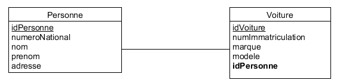

## Création de BDs

 

### 1. Créez une base de données ExoMagasin 

1. Créez un tableau Produit (id, nom, prix)
2. Insérez deux produits
3. Rajoutez une colonne 'description'
4. Rajoutez une colonne 'disponible' du type boolean
5. Modifiez la colonne 'disponible'. Elle sera INT maintenant et s'appellera 'unitesDisponibles'
6. Rajoute deux produits
7. Créez un tableau Client (id, login, motPass, adresse, adresseMail, telephone, codePostal, dateInscription, actif)
8. Rajoutez deux Clients

 

### 2. Créez une BD pour le schéma suivant :

Lien de propriété entre personnes et voitures

 

 

### 3. Créez une BD pour le schéma suivant :

 

Insérez de données en utilisant phpMyAdmin ou Adminer. Puis étudiez le SQL généré et créez vos propres requêtes d'insertion.
Faites la même chose pour apprendre à effacer de données.