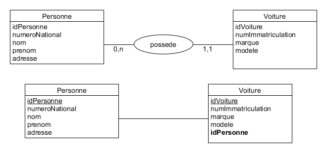
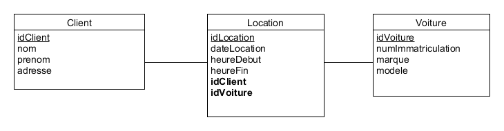

## Création de BDs

 

Créez les BDs pour les schémas suivants :

### 1. Lien de propriété entre personnes et voitures

 

### 2. Lien de location de voitures par de clients

 

Insérez de données en utilisant phpMyAdmin ou Adminer. Puis étudiez le SQL généré et créez vos propres requêtes d'insertion.
Faites la même chose pour apprendre à effacer de données.